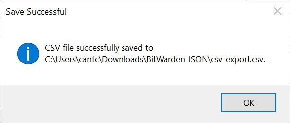

# BitWarden-JSON-Converter
A C# Form that converts a BitWarden vault JSON export to a report that can be printed.  This is a side project for myself and is still in progress.  I am a student learning the basics of C# at the moment and thought this kind of project would help me stretch a little more.

## Requirements
+ .NET 8.0
+ An exported BitWarden JSON file (not encrypted)
+ Custom fields are not supported in the current version of this application

## How to Install/Run
There are two options for downloading and running this project.  Both require downloading a copy of the repository.  
* If you are using Git then you can clone a copy of the repository.  If you aren't using Git, you can click the Green **Code** button and click **Download Zip**.
* If you have Visual Studio installed or another similar code editor, you can load the project directly and run it from there.  If you don't have Visual Studio, you can navigate to *BitWarden JSON/bin/Release/net8.0-windows/publish/BitWarden JSON.exe*

An example .json file is also provided in this repository for your testing of the application.

## How to Use the Application
* When the application is run it will first prompt for a BitWarden .json file.  You can type in the path to the file or browse to it.

* A table view of all of the items in the .json file is shown.

* Clicking on the cell in the first column for any given row will show the object contents for that particular type of item.  Below are some examples of these different views.

* Click on the **Hide Columns** button will bring up another window where you can select the columns that you'd like to hide/show from the current table view.

* Click on the **Show All Columns** to instantly show all hidden columns.
* Clicking on the **Print** or **Save to CSV** buttons will ask the user if they want to remove any empty columns in the table.  Saying yes, will remove the columns from the table (not hide - you won't get these back if you want to do more work with them after printing or saving; to get them back you'll have to reload the .json file).

* If saving to a CSV, once the save has been completed, a success message will appear.

## Existing Known Bugs
There are some existing bugs/flaws with this current project that I know about for sure and probably many others that I have no idea about.
* There is no way to change how much data appears on a page at a time.  If you have a large dataset this could get divided across multiple pages and you could end up printing a *lot* more than you were expecting.  Please use caution with this option and print to a .pdf first rather than an actual printer.
* The application is limited to using the default fields from BitWarden.  If you use custom fields in your application, out of the box this application will not work for you.
* I don't love the look and feel of the entire application.  It feels clunky, but considering how this was my first venture into a C# project on my own, I thought it turned out alright.
